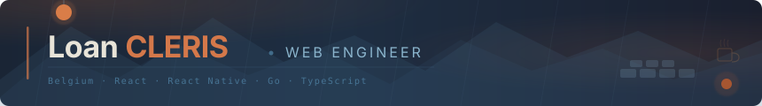
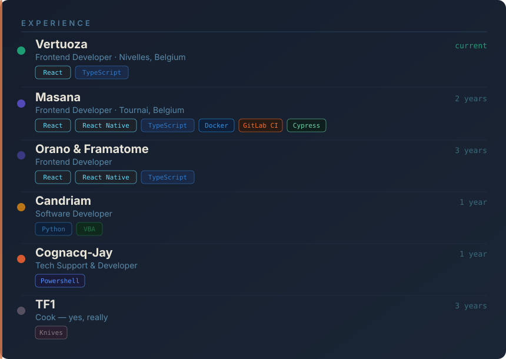
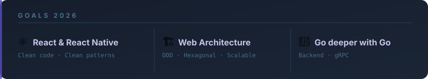

<div align="center">
  
</div>

<div align="center">

[](https://git.io/typing-svg)

<br/>

[](https://loan-cleris.com)
[](https://www.linkedin.com/in/loan-cleris/)
[](https://instagram.com/loan_cleris/)

</div>

---

## 👨🏻‍💻 About me

```yaml
name: Loan CLERIS
location: Courcelles, Belgium
current_job: Frontend Developer @ Vertuoza (Nivelles, Belgium)

education:
  - Master en Ingénierie Du Web — ESGI
  - Licence Pro Informatique Full Stack — EFFICOM
  - BTS SIO SLAM — AFORP / EFFICOM

currently_learning: [TanStack Start, Go]

hobbies: [Gaming, Cinema, Cars, Cooking]
```

---

## 🚀 Tech stack

**Frontend**


**Backend**


**Infra & DX**


**Testing**


---

## 💼 Experience

  

---

## 🎯 Goals 2026



---

<div align="center">
  
</div>
